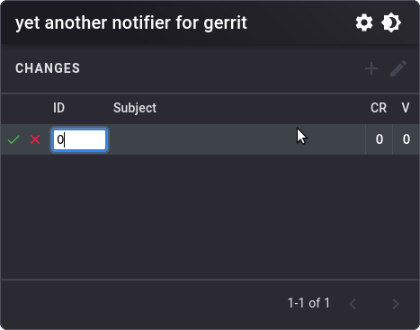

# Yet Another Notifier ~~for~~ Gerrit (YANG)


An open-source browser extension to receive update notifications about
Change-Ids from Gerrit. The main motivation behind this project is to decrease
the time spent while you manually check updates in Change-Ids. And for this,
there is nothing better than using the own Web API from Browser to send
notifications to your desktop when any of your watched Change-Ids receives an
update.<br/><br/>

<p align="center">
    
</p>
<p align="center">
    <em><i>See how easy it is to use. :sunglasses:</i></em>
</p>

## Installation

Currently, this browser extension is **not** published in any store yet. So in
case you want to use it, you need to install the extension manually. It is
possible to download this extension from Releases page, or even build locally
for the targeted browser.

After installing it, the first thing you should do is to set up the Gerrit
configuration in Options page (use **Test** button to check if endpoint and
credentials are working fine\*).

And if you are afraid to use this extension, for whatever the reason, check
permissions in [manifest.json](app/manifest.json) and also the code.

**Don't forget to save the Gerrit configuration :grin:*

## Development

This extension was developed using [WebExtension
Toolbox](https://github.com/webextension-toolbox/webextension-toolbox/) (it
makes easier to develop a cross-browser extension).

[TALK ABOUT TOOLS]: React, Jest, ESLint

### Quick Start

```bash
# First, clone it, and then install the dependency packages
npm install

# For local development
npm run dev <browser>

# Or if you want to create a bundle for production
npm run build <browser>
```

**Possible options for browser: chrome, firefox, opera, edge*

## Work In Progress

- [ ] Improve theme
  - [ ] Use a standard font globally
  - [ ] Add Dark theme for Options page
  - [ ] Move remaining shared components from Popup to Theme
- [ ] Options page
  - [ ] Improve validation for settings
- [x] Build the first release
- [ ] Publishing
  - [ ] Chrome Web Store
  - [ ] Firefox Browser Addons
